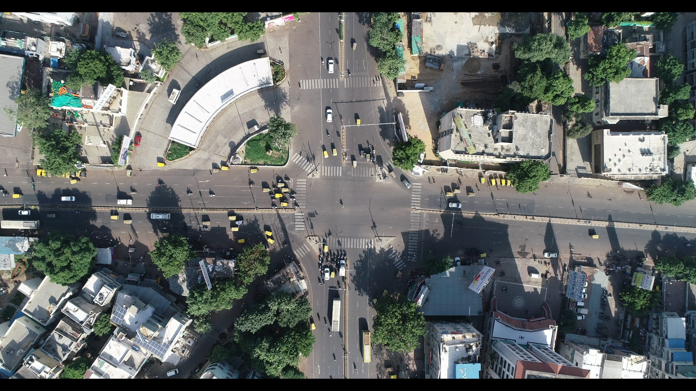
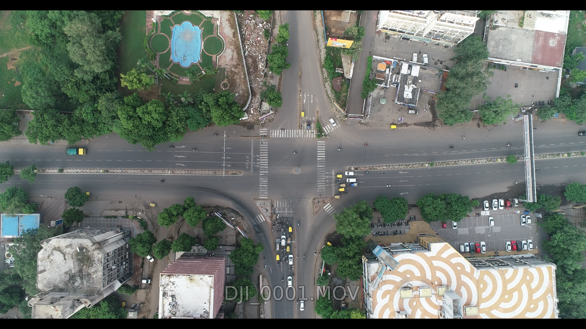
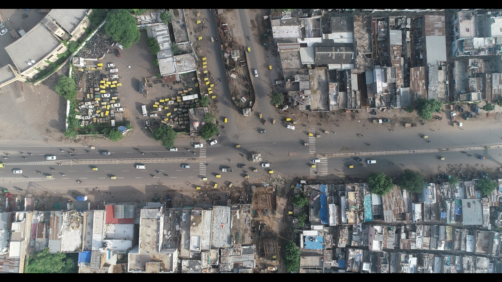
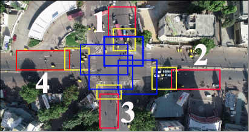
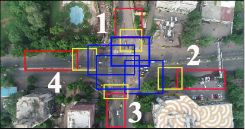
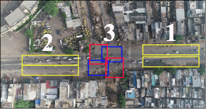

# EyeonTraffic(EoT) Dataset
## Dataset for analyzing lane-less traffic state behavior at intersections
 

<b>EyeonTraffic (EoT) Dataset</b> is the first aerial view data for defining spatio-temporal annotations in order to estimate the traffi congestion state under lane-less behavior. There were total of 3 intersections chosen for the EoT dataset with  around  1  hour  of  aerial  video  recorded  for  each  of the intersections, namely, Paldi (P), Nehru bridge - Ashramroad (N), and APMC market (A) in the city of Ahmedabad, India. These  intersections  were  considered  because  of  the diverse traffic conditions they present. While Paldi and Nehru bridge are  four-way  signalized  intersections, APMC  marketis a three-way non-signalized intersection. Hence, this dataset comprehensively  covers  a  wide  variety  of  traffic  conditions for  both  signalized  and  non-signalized  intersections.  Details of the tracking annotations are found in [SkyEye](https://github.com/debadityaroy/SkyEye/) repository.

**Paldi (P)**         | **Nehru Bridge Ashram Road (N)**       
----------------|--------------
 |
4-way signalized intersection | 4-way signalized intersection 
**APMC market (A)**

3-way unsignalized intersection

<h2> Annotation </h2>

<h3> Spatio - Temporal annotations </h3>

Spatial regions of traffic states for the above intersections are manually annotated as shown below  

**Red: Clump, Yellow: Neutral, Blue: Unclump**

**Paldi (P)**         | **Nehru Bridge Ashram Road (N)**       
----------------|--------------
 |
4-way signalized intersection | 4-way signalized intersection 
**APMC market (A)**

3-way unsignalized intersection

Spatial annotations can be downloaded here:[Paldi](https://drive.google.com/file/d/1QwkxbhTl25x9F1sOD8iH3Hy-yMmqYXD2/view?usp=sharing), [Nehru](https://drive.google.com/file/d/1x7GMiAUyp47DPDXtt5KoRqhoKFk_bYTI/view?usp=sharing), [APMC](https://drive.google.com/file/d/1XXFk2RGhHDkUfyARKSZe-mhEuAmDFEqb/view?usp=sharing)

Temporal annotations and corresponding videos can be downloaded using below table

Paldi|| Nehru|| APMC||
-|-|-|-|-|-|
Video|Annotation| Video|Annotation| Video|Annotation| 
[1_1.mp4](https://drive.google.com/file/d/1W6fGg_k83EBXf_gfJyxJJNoz76WcRrpS/view?usp=sharing)|[Paldi_1_1.csv](https://drive.google.com/file/d/17F6drdN36469GVZnt2-KGSC6vWh-Kib2/view?usp=sharing)| [3_1.mp4](https://drive.google.com/file/d/1-mKo8MC68oEtVh201TnswEHKZjfREY6v/view?usp=sharing)|[Nehru_3_1.csv](https://drive.google.com/file/d/1EwNsix-gCpOsAJa5wpNBmcXXClQujWCi/view?usp=sharing)| [4_1.mp4](https://drive.google.com/file/d/1MK8JZmXJLnBVKFBd8OU_HZPh_wlKESK7/view?usp=sharing)|[APMC_4_1.csv](https://drive.google.com/file/d/1VW2QIqhIr7Vq0SN0q9P8mCWLCo_D_y8s/view?usp=sharing)| 
[1_2.mp4](https://drive.google.com/file/d/1BVz7Kh4gCrUQxfK9G7IlhDJVcSOUTgKr/view?usp=sharing)|[Paldi_1_1.csv](https://drive.google.com/file/d/1GWdL7dBEvi-G2UD_HoE_oC5rH1cSB7Ts/view?usp=sharing)| [3_2.mp4](https://drive.google.com/file/d/1PPJidGwy0oe8Zu2Ccd8ErQjzW8_So-wC/view?usp=sharing)|[Nehru_3_2.csv](https://drive.google.com/file/d/17vbPp-rlAh49LeYEoT6GQEzOcw-V8JD9/view?usp=sharing)| [4_2.mp4](https://drive.google.com/file/d/1oBdYcbuO4cM16KXHd5cluy3XbuENDEpV/view?usp=sharing)|[APMC_4_2.csv](https://drive.google.com/file/d/1e-zU9bFTDHckBDrESk9TTlPZcj5Sd5ee/view?usp=sharing)| 
[1_3.mp4](https://drive.google.com/file/d/1ReLqI7zfQru7RnVNbxofU9XnV1yuEKt8/view?usp=sharing)|[Paldi_1_1.csv](https://drive.google.com/file/d/1lCYJ3Tu214TPZjyu6cyqDsPVMjK5QnhK/view?usp=sharing)| [3_3.mp4](https://drive.google.com/file/d/191CdrD223OiP9PUcnaz4btyf8UfLcPXH/view?usp=sharing)|[Nehru_3_3.csv](https://drive.google.com/file/d/1DW4LLuWe_YKrVosPXt7XKVgAlNklTyeS/view?usp=sharing)| [4_3.mp4](https://drive.google.com/file/d/1wMFQNJzOn1bjSqA34H8Mwtn9AICwQdN5/view?usp=sharing)|[APMC_4_3.csv](https://drive.google.com/file/d/1gzV-wGHD7tafPNZ0ZrecvNbtPx11KH-6/view?usp=sharing)| 
NA|NA|[3_4.mp4](https://drive.google.com/file/d/1mvdfsFFsENlQDXHOadPeuHUnHsQjOOR5/view?usp=sharing)|[Nehru_3_4.csv](https://drive.google.com/file/d/1I-Y94tqC0bscpdGzTmhlqbqwqbZjCHKF/view?usp=sharing)|NA|NA| 

Finally the Spatio-Temporal annotations segmented at the rate 5fps combining spatial and temporal annotations and for 3 intersections can be downloaded from below table:

State|Paldi| Nehru| APMC |
Clump|[P_C](https://drive.google.com/drive/folders/167InTOE5rwVDMPME-5u3oZR43odK5pN_?usp=sharing)|[N_C](https://drive.google.com/drive/folders/1LDJpIHh70UYiNsDphzcl_h48GBTfZpKl?usp=sharing)|[A_C](https://drive.google.com/drive/folders/16j7F3znca_HAsfGtpjdzPPcZjIaT4YFe?usp=sharing)|
Neutral|[P_N](https://drive.google.com/drive/folders/1GNjcOhctVALqUQffoqBnnHVH8InPcnKJ?usp=sharing)|[N_N](https://drive.google.com/drive/folders/1-5ZafOJwDU0tPjiWv4ixCzZI3XcpADy1?usp=sharing)|[A_N](https://drive.google.com/drive/folders/1de8WWPRHL92g_qGOExMYI7uvLfVvub7M?usp=sharing)|
Unclump|[P_U](https://drive.google.com/drive/folders/19zeHDCnB9dlrnuvexwzKJjcF0IWeNoas?usp=sharing)|[N_U](https://drive.google.com/drive/folders/1XwuTcwxlkSL6emuK7yrFiqVDYtxH2Na2?usp=sharing)|[A_U](https://drive.google.com/drive/folders/146ZAW3kKI_KM2aRL2HfnYc6tSmK-JbAK?usp=sharing)|

